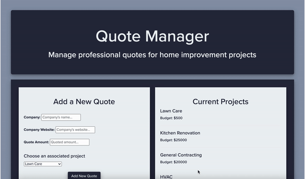

<h1 align="center">:wrench: Professional Quote Manager :house_with_garden:</h1>

A quote management app to help homeowners keep track of professional quotes for home projects.

Check it out: [Frontend Repo](https://github.com/ejgann/quote_manager_frontend) ||  [Demo](https://vimeo.com/497047241)

## Built With

### Backend  
* Ruby v2.6.1
* Rails v6.0.3 - MVC web framework used as an API
* Fast JSON API 
* Rack-Cors
* Active Model Serializers - Serializing API routes to JSON
* PostgreSQL v11 - Database

### Frontend  
* Vanilla JavaScript [ES6]
* Bootstrap v3.4.1
* Custom CSS3 styling

## Installing

### Backend Installation:
* Clone this repo to your local machine -- `git clone <this-repo-url>`
* Run `bundle install` to install required dependencies
* Run `rails db:create` to create a local database
* Run `rails db:migrate` to add tables to the database
* Run `rails db:seed` to create seed data
* Run `rails s` to start the rails server

### Frontend Installation:
* Clone [frontend repo](https://github.com/ejgann/quote_manager_frontend) to your local machine -- `git clone <frontend-repo-url>`
* Ensure the quote_manager_backend is running at `http://localhost:3000/`
* Run `open index.html`

## Features

* A user can view a table containing all of the quotes they have accumulated for all household projects
* Upon receiving a new project quote, the user can add that information as a new quote
* The user can toggle a list of their current projects, including the alotted budget for each

